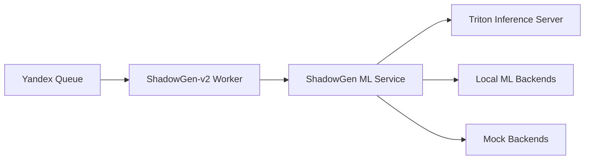
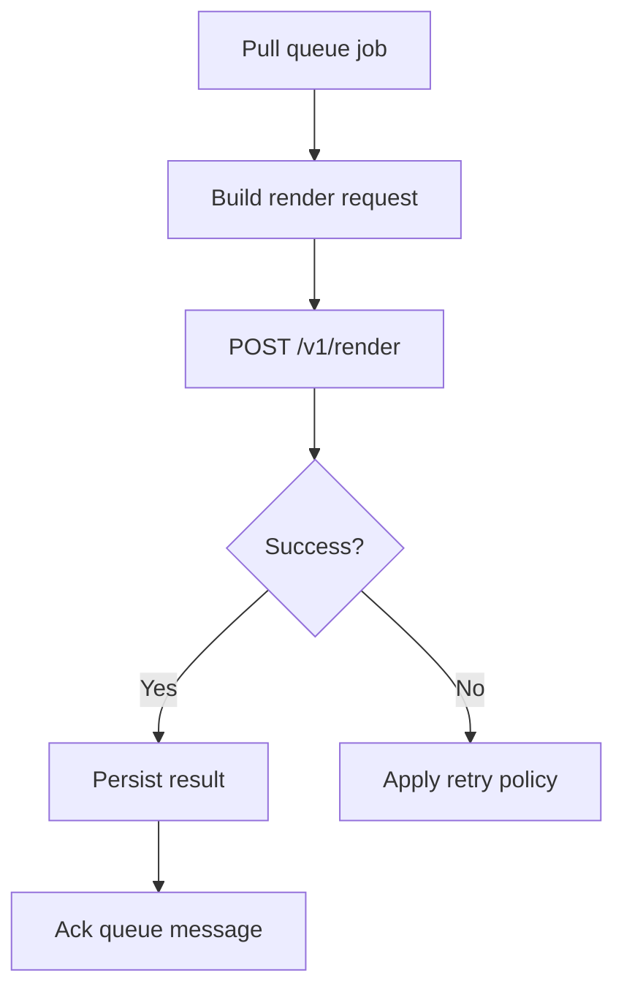
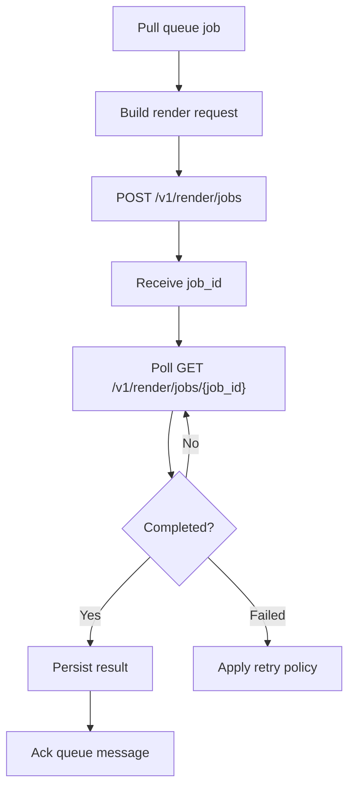

# Worker <-> ML Core Contract

## Purpose

This document defines the integration contract between:

- `ShadowGen-v2` worker
- `ShadowGen ML Service` as the ML core

The goal is to support both:

- legacy synchronous ML cores
- the current ML core with synchronous and asynchronous APIs

while keeping the worker simple and leaving stage-level batching decisions inside the ML core and Triton execution layer.

## Roles

### Worker

The worker is a job dispatcher.

It is responsible for:

- pulling business jobs from the external queue
- converting a business job into a render request for the ML core
- selecting the submission mode supported by the current ML core
- limiting how many jobs are in flight toward the ML core
- tracking retries, timeouts, and final job state at the business layer

The worker is **not** responsible for:

- stage scheduling
- tensor batching
- deciding which stage uses `mock`, `local`, or `triton`
- understanding model internals

### ML Core

The ML core is the pipeline orchestrator.

It is responsible for:

- validating the render request
- running the render pipeline
- selecting stage executors
- deciding whether heavy-stage batching is possible
- exposing machine-readable capabilities
- returning sync or async execution results

### Triton

Triton is an execution backend for heavy stages.

It is responsible only for model inference, not for:

- job ownership
- queue semantics
- business retries
- full-pipeline orchestration

## Recommended Topology



## Design Rule

The worker owns **job concurrency**.

The ML core owns **stage concurrency and stage batching**.

This means:

- the worker may send multiple jobs to the ML core at the same time
- the worker must not try to batch tensors itself
- the ML core may choose to batch compatible heavy-stage requests internally
- Triton may then execute batched inference requests

## Compatibility Goal

The worker must support two ML-core modes:

1. `sync-only compatibility mode`
2. `async-native mode`

The worker should discover this at runtime through `GET /v1/capabilities`.

## Capability Handshake

Before submitting jobs, the worker should call:

- `GET /health`
- `GET /v1/capabilities`

The worker should repeat the capabilities refresh:

- on startup
- on ML-core restart
- on configuration reload
- periodically, for example every 30-60 seconds, if the deployment is dynamic

### Minimum Fields the Worker Must Read

From `GET /health`:

- `status`
- `async_enabled`
- `accepting_jobs`
- `preferred_submit_mode`

From `GET /v1/capabilities`:

- `execution_default_backend`
- `async_enabled`
- `supported_submit_modes`
- `preferred_submit_mode`
- `job_execution`
- `batching_strategy`
- `component list`

For each component, the worker should be able to read:

- `name`
- `available`
- `backend_kind`
- `model_variant`
- `supports_batching`
- `supports_async`
- `fallback_reason`
- `backends`

### Capability Interpretation Rules

The worker must interpret capabilities as follows:

- `async_enabled=true`
  - the ML core supports async job submission
- `async_enabled=false`
  - the worker must use sync render submission
- heavy-stage `supports_batching=true`
  - batching may happen inside the ML core or Triton path
  - this does **not** mean the worker should submit tensor batches
- `backends[*].supports_batching=true`
  - that specific backend family supports batched inference
- `available=false`
  - the backend or stage should not be relied upon as primary execution

## Submission Modes

### Mode A: Sync Compatibility Mode

Use when:

- the ML core is old and only supports `POST /v1/render`
- or the new ML core reports `async_enabled=false`

Worker behavior:

1. pull one job from the queue
2. transform it into a render request
3. call `POST /v1/render`
4. wait for the response
5. persist the result
6. acknowledge or retry the queue message

Contract:

- request endpoint: `POST /v1/render`
- result is returned inline
- timeout and retry are controlled by the worker

### Mode B: Async-Native Mode

Use when:

- the ML core reports `async_enabled=true`

Worker behavior:

1. pull one job from the queue
2. transform it into a render request
3. call `POST /v1/render/jobs`
4. receive `job_id`
5. poll `GET /v1/render/jobs/{job_id}`
6. on completion, persist the result
7. acknowledge or retry the queue message

Contract:

- request endpoint: `POST /v1/render/jobs`
- job state endpoint: `GET /v1/render/jobs/{job_id}`
- optional cancel endpoint: `DELETE /v1/render/jobs/{job_id}`

## Worker Decision Algorithm

Recommended worker algorithm:

```text
1. Probe ML core health.
2. Fetch capabilities.
3. If async_enabled == true:
   - use async-native mode
4. Else:
   - use sync compatibility mode
5. Limit worker-side in-flight jobs by configuration.
6. Do not build tensor batches in the worker.
7. Let the ML core decide whether heavy-stage batching is beneficial.
```

## In-Flight Concurrency

The worker should support configurable in-flight concurrency.

Recommended worker settings:

- `max_in_flight_jobs`
- `submit_timeout_ms`
- `poll_interval_ms`
- `job_ttl_ms`
- `max_retries`

Important rule:

- concurrency is controlled at the **job** level
- batching is controlled at the **stage inference** level

This is the clean separation of responsibilities.

## Batching Contract

### What the Worker Must Assume

The worker must assume:

- batching is an optimization internal to the ML core
- batching may be unavailable even when Triton exists
- batching may be enabled only for some stages
- batching may be enabled only for some backend kinds and variants

### What the Worker Must Not Do

The worker must not:

- assemble multi-image tensor payloads for the ML core
- send one request that contains several unrelated render jobs
- decide which stage families are batch-compatible
- delay jobs on its own to create manual tensor batches

### What the Worker May Do

The worker may:

- keep several jobs in flight
- use higher in-flight concurrency when the ML core reports batching support
- reduce in-flight concurrency when the ML core is degraded or in sync-only mode

### Professional Batching Boundary

The professional batching boundary for this system is:

- after detection and canonical crop / pad / resize
- inside heavy downstream stage execution

Best candidates:

- `segmenter`
- `depth_estimator`
- `normal_estimator`
- later `shadow_generator`

Weak candidates:

- `geometry_estimator`
- `detector` on arbitrary full-size inputs
- `composer`
- `artifact_encoder`

## Request Contract

The worker submits the same logical render request in both sync and async modes.

Minimum request shape:

```json
{
  "source": {
    "mime_type": "image/png",
    "data_base64": "<base64>"
  },
  "preprocess": {
    "padding_px": 100
  },
  "shadow": {
    "model": "v1-gan",
    "angle_deg": 35,
    "elevation_deg": 45,
    "softness": 0.35,
    "opacity": 0.65,
    "reflection": 0.0
  },
  "background": {
    "mode": "transparent"
  },
  "output": {
    "format": "png",
    "return_debug": false
  }
}
```

The worker should treat the request body as opaque business payload after mapping from the upstream product job.

Shadow model selection:

- `shadow.model = "v1-gan"` requests the current controllable rot/top-view GAN model
- `shadow.model = "v2-diff"` requests the current control-free diffusion model
- `shadow.model` is optional for older clients; if omitted, ML core uses its configured runtime default
- current `v2-diff` ignores angle/elevation/softness/reflection controls
- workers should forward the user-selected model when the upstream product job contains it

## Response Contract

### Sync Success

`POST /v1/render` returns:

- one final artifact
- metrics
- warnings
- model info

### Async Submit Success

`POST /v1/render/jobs` returns:

- `job_id`
- `request_id`
- `status`
- `created_at`
- `updated_at`

### Async Poll Result

`GET /v1/render/jobs/{job_id}` returns:

- job metadata
- current status
- optional error
- optional final render result

## Error Contract

The worker must handle ML-core errors using:

```json
{
  "error": {
    "code": "validation_error",
    "message": "..."
  }
}
```

Recommended worker behavior:

- `validation_error`
  - treat as non-retryable
- `queue_full`
  - retry later
- `not_accepting_jobs`
  - retry later or route around the node
- transport timeout / connection error
  - treat as retryable according to worker retry policy
- `processing_failed`
  - retryable or non-retryable depending on business policy
- async job `failed`
  - inspect job error and apply queue retry policy

## Worker State Machine

### Sync Mode



### Async Mode



## Recommended Worker Policy

Recommended defaults for worker authors:

- support both sync and async ML-core modes
- prefer async mode when available
- keep worker concurrency configurable
- do not implement manual tensor batching in the worker
- use capabilities refresh to adapt to ML-core mode changes
- fail closed when capabilities are missing or inconsistent

## Recommended Deployment Evolution

### Stage 1

- existing worker
- sync-only old ML core

### Stage 2

- same worker code
- new ML core
- async jobs enabled
- no Triton yet or Triton optional

### Stage 3

- worker with configurable in-flight concurrency
- ML core receives multiple jobs concurrently
- ML core enables stage-level batching where useful
- Triton executes heavy batched inference

## Contract Stability

This document defines the recommended stable integration layer for the worker team.

Stable assumptions:

- the worker talks to the ML core only via HTTP API
- sync and async modes may both exist
- capabilities are the source of truth for feature detection
- batching support is discovered from the ML core, not invented by the worker
- stage-level batching remains internal to the ML core and execution layer
- `request_id`, when present, is the async idempotency key on the ML-core side
